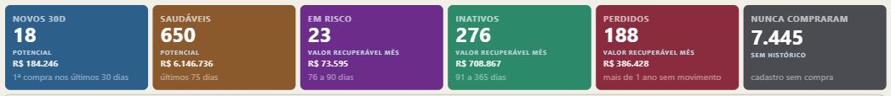

# FlowCards

[English](README.md) · **Português**

Visual personalizado para **Power BI** que desenha **um cartão por valor de uma
categoria**, lado a lado, e **filtra a página quando um cartão é clicado**.



*As seis etapas do ciclo de vida de uma base real, da esquerda para a direita. Clicar num cartão filtra o resto da página.*

## O que é / quando usar

Ele existe porque nenhum visual nativo faz três coisas ao mesmo tempo: parecer
uma faixa de cartões, respeitar uma ordem definida pelo modelo, e filtrar a
página ao clique. A alternativa nativa testada para isso, uma matriz, foi
descartada por inspeção visual.

Use para o ciclo de vida de um cliente (saudável, em risco, inativo, perdido),
um funil de vendas, uma quebra de status de pedido, uma faixa de estoque, ou
qualquer categoria com poucos valores que se beneficie de ser lida em
sequência, da esquerda para a direita.

O visual é genérico: ele não sabe o que significa "Saudável". Ele só desenha um
cartão por valor de categoria, na ordem em que os recebe, e avisa o clique.

## Campos

| Campo | Obrigatório | Papel |
|---|---|---|
| **Categoria** | sim | um cartão por valor distinto |
| **Valor** | sim | o número grande do cartão |
| **Valor 2** | não | métrica secundária, menor |
| **Rótulo do valor 2** | não | texto acima do valor 2 |
| **Rodapé** | não | legenda pequena no pé do cartão |
| **Cor** | não | sobrepõe a cor configurada da categoria |

**Rótulo do valor 2 e Rodapé são medidas, não texto fixo.** Isso é deliberado:
permite o texto mudar por cartão sem o visual saber o porquê. Por exemplo,
"Potencial" no cartão de clientes saudáveis e "Recuperável no mês" no de risco,
"até 75 dias" num cartão e "mais de 1 ano" noutro, cada um escrito por uma
medida DAX que avalia por categoria.

## Ordem dos cartões

**O visual não ordena.** Ele respeita a ordem em que o Power BI entrega as
categorias, que vem do **Sort by column** (Classificar por coluna) do modelo.
Isso é deliberado: manter a ordenação no modelo faz ela valer igual em todo
visual do relatório, e não só neste. Se os cartões saírem na ordem errada, o
ajuste é no Sort by column do campo, não numa opção deste visual.

## Cartão sem valor secundário

Quando **Valor 2** vem vazio para um cartão, **o número some e o rótulo fica**.
Não há traço nem zero, porque os dois dariam a impressão de um valor nulo em
vez de um valor que não existe para aquela categoria. Isso é configurável por
campo em **Mostrar em branco como** (nos cartões Valor e Valor 2), para quem
preferir mostrar algo em vez de nada.

## Interação

- Clique num cartão: substitui a seleção atual
- Ctrl (ou Cmd) mais clique: acumula na seleção
- Clicar de novo num cartão já selecionado: desmarca
- Tab move o foco entre os cartões, Enter ou Espaço aciona o cartão focado
- O cartão selecionado ganha uma borda de destaque; os demais escurecem

Um interruptor no painel de formatação desliga a seleção múltipla, para
relatórios que devem travar em um cartão por vez.

## Opções de formatação

| Cartão | Propriedade | Padrão |
|---|---|---|
| **Cards** (Cartões) | Largura máxima (0 = sem limite) | 0 |
| | Altura mínima | 0 |
| | Raio do canto | 10 px |
| | Espaço entre cartões | 9 px |
| | Preenchimento interno | 13 px |
| **Category colors** (Cores por categoria) | Um seletor de cor por valor de categoria | paleta fixa de 8 cores, repetida por posição |
| **Title** (Título) | Fonte (família / tamanho / negrito / itálico) | Segoe UI / 9,5 / negrito |
| | Cor | `rgba(255,255,255,0.64)` |
| | Transparência | 0% |
| | MAIÚSCULAS | Ligado |
| | Espaçamento entre letras | 0,8 px |
| **Value** (Valor) | Fonte (família / tamanho / negrito / itálico) | Segoe UI / 26 / negrito |
| | Cor | `#FFFFFF` |
| | Transparência | 0% |
| | Unidade de exibição | Automático |
| | Casas decimais (-1 = automático) | 1 |
| | Mostrar em branco como | (vazio) |
| **Second value label** (Rótulo do valor 2) | Fonte (família / tamanho / negrito / itálico) | Segoe UI / 8,5 / negrito |
| | Cor | `rgba(255,255,255,0.52)` |
| | Transparência | 0% |
| **Second value** (Valor 2) | Fonte (família / tamanho / negrito / itálico) | Segoe UI / 13,5 / negrito |
| | Cor | `rgba(255,255,255,0.88)` |
| | Transparência | 0% |
| | Unidade de exibição | Nenhuma |
| | Casas decimais (-1 = automático) | 0 |
| | Mostrar em branco como | (vazio) |
| **Footnote** (Rodapé) | Mostrar | Ligado |
| | Fonte (família / tamanho / negrito / itálico) | Segoe UI / 10 / normal |
| | Cor | `rgba(255,255,255,0.42)` |
| | Transparência | 0% |
| **Selection** (Seleção) | Permitir múltipla | Ligado |
| | Opacidade dos apagados (cartões não selecionados) | 38% |
| | Cor da borda de destaque | `#FFD98A` |
| | Espessura da borda | 2 px |

> A **unidade de exibição** funciona como nos visuais nativos do Power BI:
> Automático escala o número pela própria magnitude (pode transformar 386.843
> em 0,4M), Nenhuma mostra o número cru, e Milhares/Milhões/Bilhões/Trilhões
> fixam a unidade. O cartão Valor vem em Automático (leitura de relance); o
> cartão Valor 2 vem em Nenhuma, porque um número secundário costuma ser o que
> se lê exatamente, não o que se compara de relance.

## Como compilar

Requer **Node.js** e o [powerbi-visuals-tools](https://www.npmjs.com/package/powerbi-visuals-tools)
(`npm i -g powerbi-visuals-tools`).

```bash
npm install        # dependências
npm test           # testes unitários da lógica de dados (vitest)
npm run package     # gera dist/*.pbiviz
```

O arquivo `.pbiviz` resultante (em `dist/`) é o que você importa no Power BI.

## Como importar no Power BI Desktop

1. **Inserir → Mais visuais → Importar visual de um arquivo**.
2. Escolha o arquivo `dist/*.pbiviz` (ou baixe-o da
   [página de Releases](https://github.com/viniciusduartelage/flowcards/releases)).
3. O visual "FlowCards" aparece no painel de visualizações.

## Desenvolvimento (ao vivo)

```bash
npm start
```
Com o **"Visual de desenvolvimento"** habilitado no Power BI (Service ou
Desktop), o visual recarrega a cada alteração.

## Estrutura do projeto

```
src/visual.ts      # IVisual: render + interações
src/settings.ts    # cartões do painel de formatação (FormattingModel)
src/dataModel.ts   # lógica pura (lê o dataView e devolve um modelo tipado), testada
style/visual.less  # estilo base (variáveis CSS alimentadas pelas opções)
capabilities.json  # campos + mapeamento + objetos de formatação
test/              # testes unitários (vitest)
```

## Idioma

A interface fica em **inglês** por padrão e muda automaticamente para
**português** quando o Power BI / Windows está em português (pt-BR ou pt-PT).
A localização segue o idioma do relatório (`host.locale`); outros idiomas caem
para o inglês.

## Licença

[GPL-3.0-or-later](LICENSE) © 2026 Vinicius Duarte. Livre e de código aberto,
todos os recursos incluídos. Qualquer um pode usar (inclusive empresas), mas
qualquer fork ou redistribuição deve permanecer aberto sob a GPL, então
ninguém consegue fechar e revender como produto proprietário. Baixe o
`.pbiviz` mais recente na
[página de Releases](https://github.com/viniciusduartelage/flowcards/releases)
e importe no Power BI.
